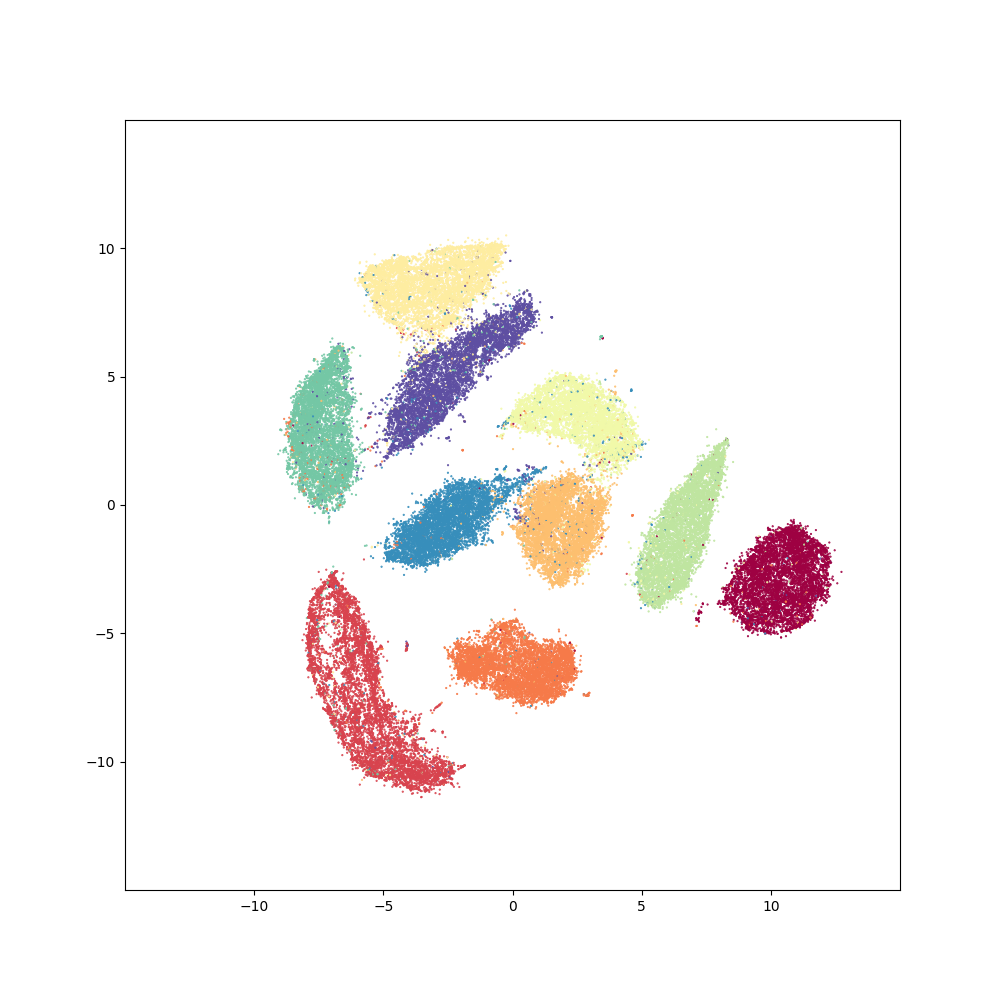
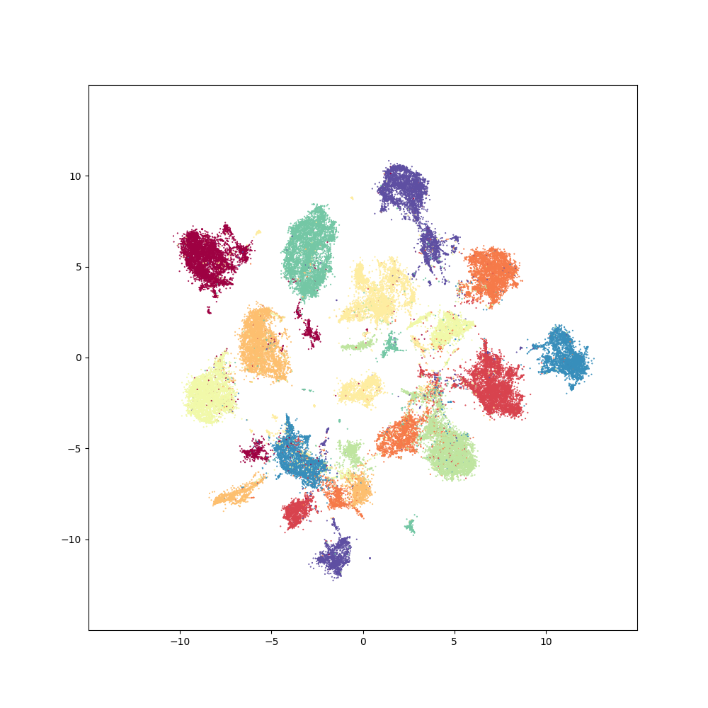

## Results
We tested Progressive UMAP on various benchmarks. Here I introduce some of the results. Detailed information on each dataset is explained [here](https://github.com/hyungkwonko/progressive-umap/blob/master/data/README.md).

### Fashion MNIST
About one third of the total embedding time was required for Progressive UMAP compared to original UMAP implementation. As illustrated, although the number of points embedded are fewer, the output visualization was almost the same.

|            UMAP             |      Progressive UMAP     |
:----------------------------:|:--------------------------:
|     200 epochs (68.3s)       |     200 epochs (20.4s)   |
|

### MNIST

|            UMAP             |      Progressive UMAP     |
:----------------------------:|:--------------------------:
|     200 epochs (65.9s)      |     200 epochs (19.8s)    |
|

### Kuzushiji MNIST
There is a problem in current Progressive UMAP implementation. When appending new points, it locates them calculating dimension-wise mean value of its k-nearest neighbors. As seen below, when one class is divided into big clusters more than one, newly inserted points does not position well and harm the overall performance of embedding. One of the reasons for this is the bias of finding k-nearest neighbors that is not fully supportive to forming local manifold because of progressive process. We plan to solve it by locating them into one of the clusters' centroid, so they can capture the local manifold well.

|            UMAP             |      Progressive UMAP     |
:----------------------------:|:--------------------------:
|     200 epochs (68.4s)      |     200 epochs (47.9s)    |
|
